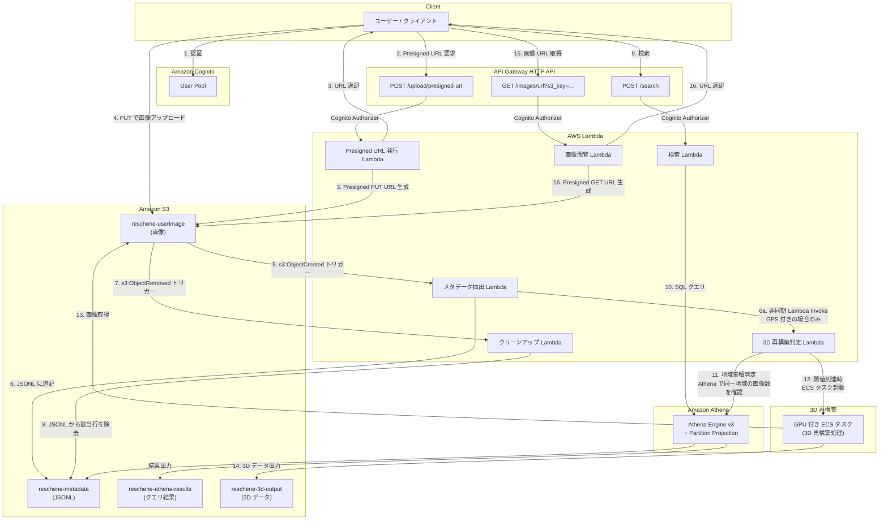
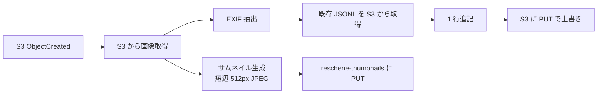
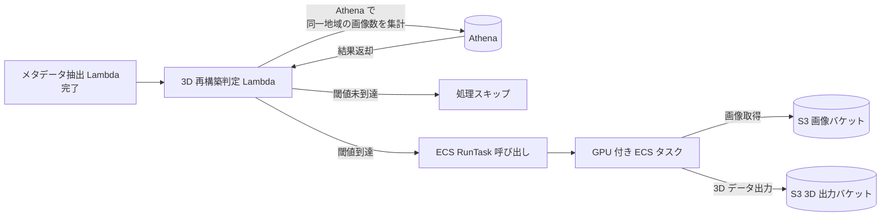
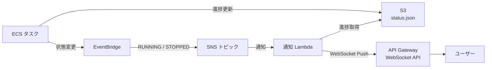

# Reschene - アーキテクチャ設計

## 1. システム概要

ユーザーが JPEG 画像を S3 にアップロードすると、自動的に EXIF 情報 (GPS 座標・カメラモデル) を抽出し、メタデータを S3 に JSON Lines 形式で格納する画像管理システム。メタデータの検索・地理空間クエリには Amazon Athena を使用する。さらに、同一地域の画像が一定数集まった場合に GPU インスタンス上で 3D データ再構築処理を自動実行するパイプラインを備える。

| カテゴリ       | 技術                            |
| -------------- | ------------------------------- |
| 言語           | Python 3.12                     |
| IaC            | AWS CDK (Python)                |
| パッケージ管理 | uv                              |
| 認証           | Amazon Cognito                  |
| API            | API Gateway HTTP API            |
| コンピュート   | AWS Lambda                      |
| ストレージ     | Amazon S3 (5 バケット: userimage / metadata / athena-results / 3d-output / thumbnails) |
| クエリエンジン | Amazon Athena (Engine v3)       |
| 3D 再構築      | GPU 付き EC2 (ECS EC2 起動タイプ + オンデマンドインスタンス) |
| ジョブ起動     | AWS Lambda (S3 イベント → 判定 → ECS タスク起動) |

> **Note**: Athena は内部的に AWS Glue Data Catalog をメタストアとして使用するが、Glue Crawler や Glue ETL ジョブは使用しない。テーブル定義は CDK で Glue テーブルリソースとして管理し、パーティションは Partition Projection で自動解決する。

## 2. 全体アーキテクチャ



## 3. コンポーネント詳細

### 3.1 認証 (Amazon Cognito)

- Cognito User Pool でユーザー管理を行う
- API Gateway HTTP API の JWT Authorizer として利用
- ユーザー ID (`sub`) を S3 キーのプレフィックスとして使用し、ユーザー間のデータ分離を実現
- **Google IdP 連携**: Cognito Hosted UI 経由で Google アカウントによるログインが可能
  - Google Cloud プロジェクト `reschene-identity-provider` で OAuth 2.0 ウェブアプリケーション クライアントを作成
  - Google Client ID / Secret は `.env` ファイルで管理し、CDK デプロイ時に `dotenv` で読み込む
  - Cognito ドメイン: `reschene.auth.us-east-1.amazoncognito.com`
  - OAuth フロー: Authorization Code Grant
  - スコープ: `openid`, `email`, `profile`
  - 属性マッピング: `email` → Google Email, `name` → Google Name, `picture` → Google Picture
  - コールバック URL: `http://localhost:3000/callback` (開発用。本番環境では本番ドメインに変更)
  - サポートする IdP: Google, Cognito (ユーザー名/パスワード認証も併用可能)

### 3.2 Presigned URL 発行 Lambda

**エンドポイント**: `POST /upload/presigned-url`

**リクエスト**:

```json
{
  "files": [
    { "filename": "photo1.jpg" },
    { "filename": "photo2.jpg" }
  ]
}
```

**レスポンス**:

```json
{
  "upload_id": "01926b7e-...",
  "urls": [
    {
      "filename": "photo1.jpg",
      "presigned_url": "https://...",
      "s3_key": "{user_id}/01926b7e-.../photo1.jpg"
    }
  ]
}
```

**仕様**:

- Content-Type を `image/jpeg` に制限 (Presigned URL の conditions で強制)
- 一括アップロード対応: リクエストで複数ファイルを指定可能
- S3 キー形式: `{user_id}/{uuid_v6}/{original_filename}.jpg`
  - `user_id` — Cognito の `sub` (JWT から取得)
  - `uuid_v6` — アップロード時刻ベースの UUID v6。同一リクエスト内のファイルは同一プレフィックスにグループ化
  - `original_filename` — クライアントが指定した元のファイル名
- Presigned URL の有効期限: 15 分 (設定可能)

### 3.3 メタデータ抽出 Lambda

**トリガー**: S3 `s3:ObjectCreated:*` イベント

> **注意**: S3 イベント通知のペイロードではオブジェクトキーが URL エンコードされる (スペース → `+`、特殊文字 → `%XX`)。Lambda 側で `urllib.parse.unquote_plus()` を使ってデコードすること。

**処理フロー**:



**抽出するメタデータ**:

| カテゴリ | フィールド           | 型                                         | 説明                           |
| -------- | -------------------- | ------------------------------------------ | ------------------------------ |
| 基本情報 | `s3_key`             | `STRING`                                   | S3 オブジェクトキー            |
| 基本情報 | `user_id`            | `STRING`                                   | アップロードユーザー ID (**JSONL 行には含めない**。S3 パスから Athena がパーティション値として注入) |
| 基本情報 | `upload_id`          | `STRING`                                   | UUID v6 (グループ識別子)       |
| 基本情報 | `original_filename`  | `STRING`                                   | 元のファイル名                 |
| 基本情報 | `file_size`          | `BIGINT`                                   | ファイルサイズ (bytes)         |
| 基本情報 | `uploaded_at`        | `STRING` (ISO 8601)                        | アップロード日時               |
| EXIF     | `camera_make`        | `STRING`                                   | カメラメーカー                 |
| EXIF     | `camera_model`       | `STRING`                                   | カメラモデル                   |
| EXIF     | `datetime_original`  | `STRING` (ISO 8601)                        | 撮影日時                       |
| EXIF     | `gps_latitude`       | `DOUBLE`                                   | GPS 緯度                       |
| EXIF     | `gps_longitude`      | `DOUBLE`                                   | GPS 経度                       |
| EXIF     | `gps_altitude`       | `DOUBLE`                                   | GPS 高度 (m)                   |

- Lambda リソース設定: メモリ 512 MB / タイムアウト 30 秒

**サムネイル仕様**:

| 項目 | 設定 |
| --- | --- |
| サイズ | 短辺 512px (アスペクト比維持、長辺は比例縮小) |
| フォーマット | JPEG (品質 85) |
| 保存先バケット | `reschene-thumbnails` |
| S3 キー | `{user_id}/{uuid_v6}/{original_filename}.jpg` (元画像と同じキー構造) |
| 生成ライブラリ | Pillow (`Image.thumbnail`) |
| Lambda 権限 追加 | `s3:PutObject` on `reschene-thumbnails/*` |

**エラーハンドリング**:

| ケース | 挙動 |
| --- | --- |
| EXIF 読み取り失敗 (JPEG 破損、EXIF 非搭載) | GPS・カメラ情報を `null` として JSONL に記録する。処理は継続し Lambda を正常終了させる |
| サムネイル生成失敗 (Pillow エラー等) | サムネイルなしとして JSONL 書き込みは継続する。CloudWatch に警告ログを出力する |
| S3 PUT 失敗 (一時的なエラー) | Lambda を異常終了させ、S3 イベントの組み込みリトライ (最大 2 回、1 分/2 分後) に委ねる |
| 画像取得 (S3 GET) 失敗 | 同上 (異常終了 → リトライ) |

> **未解決課題**: GET→PUT 間のレースコンディション (並列アップロード時の行消失) は現時点では許容するが、将来的に S3 の条件付き PUT (`If-Match` を使用した楽観的ロック) での解決を検討する。詳細は 5.1 節参照。

**トリガー**: S3 `s3:ObjectRemoved:*` イベント

**処理**:

1. S3 イベントからオブジェクトキーを取得
2. ユーザーの JSONL ファイルを S3 から取得
3. 該当する `s3_key` の行を除去して S3 に PUT で上書き
4. `reschene-thumbnails` バケットの同一キーのオブジェクトを `DeleteObject` で削除 (存在しない場合は無視)

**エラーハンドリング**:

| ケース | 挙動 |
| --- | --- |
| JSONL ファイルが存在しない | 削除済みとみなして正常終了する |
| S3 GET/PUT 失敗 | Lambda を異常終了させ、S3 イベントの組み込みリトライに委ねる |
| `s3_key` に一致する行がない | 該当行なしとみなして正常終了する (冪等) |

### 3.5 検索 Lambda

**エンドポイント**: `POST /search`

リクエストの `type` に応じて Athena SQL を組み立てて実行し、結果を整形して返却する。

**リクエスト例**:

地理空間検索:

```json
{
  "type": "geo_radius",
  "latitude": 35.6812,
  "longitude": 139.7671,
  "radius_km": 5
}
```

ユーザーの画像一覧:

```json
{
  "type": "user_images",
  "user_id": "cognito-sub-xxx"
}
```

アップロードバッチ:

```json
{
  "type": "batch",
  "upload_id": "01926b7e-..."
}
```

**レスポンス例**:

```json
{
  "results": [
    {
      "s3_key": "{user_id}/01926b7e-.../photo1.jpg",
      "user_id": "...",
      "uploaded_at": "2026-02-27T12:00:00Z",
      "gps_latitude": 35.6815,
      "gps_longitude": 139.7670,
      "distance_km": 1.23
    }
  ]
}
```

**制約・既知の制限**:

> **スロットリング**: API Gateway HTTP API はデフォルトでアカウント単位 10,000 RPS のソフトリミットがある。検索 Lambda は Athena クエリを同期実行するため、1 リクエストあたり最大数秒間 Lambda が占有される。同時実行数の増加と Athena の同時クエリ制限 (デフォルト 20 クエリ/Workgroup) への対処は今後の検討事項 (9 節参照)。

### 3.6 画像閲覧 Lambda

**エンドポイント**: `GET /images/url?s3_key={s3_key_encoded}`

- `s3_key`: S3 キー (`{user_id}/{uuid_v6}/{filename}.jpg`) を URL エンコードしてクエリパラメータとして渡す

> **Note**: API Gateway HTTP API はパスパラメータ内の `%2F` (`/`) を自動デコードしてルーティングするため、パスパラメータ方式 (`/images/{s3_key_encoded}/url`) は `/` を含む S3 キーにマッチしない。そのためクエリパラメータ方式を採用する。

**認可方針**:

- API エンドポイントは Cognito JWT 認証必須 (認証済みユーザーのみ呼び出し可)
- `s3_key` に対する所有者チェックは行わない。`s3_key` を知っている認証済みユーザーであれば誰でも Presigned URL を取得できる
- 地理空間検索等で他ユーザーの `s3_key` が返却されるユースケースに対応するための設計

**処理**:

1. JWT を検証し、認証済みユーザーであることを確認
2. パスパラメータから `s3_key` を URL デコード
3. S3 の `generate_presigned_url` で `GetObject` 用 Presigned URL を生成
4. URL を返却

**レスポンス**:

```json
{
  "s3_key": "{user_id}/01926b7e-.../photo1.jpg",
  "presigned_url": "https://reschene-userimage.s3.amazonaws.com/...",
  "expires_in": 86400
}
```

**仕様**:

| 項目 | 設定 |
| --- | --- |
| Presigned URL 有効期限 | 86400 秒 (24 時間) |
| 対象バケット | `reschene-userimage` |
| Lambda 権限 | `s3:GetObject` on `reschene-userimage/*` |


### 4.1 概要

同一地域に一定数以上の GPS 付き画像が集積した場合に、GPU 付き EC2 インスタンス (ECS タスク) 上で 3D データの再構築処理を自動実行するパイプライン。メタデータ抽出 Lambda の完了を起点として、地域集積判定 Lambda が Athena で同一地域の画像数を確認し、閾値に到達した場合に ECS タスクを起動する。

> **Note**: 3D 再構築アルゴリズムの実装は別担当が行う。パイプライン基盤 (判定 Lambda / ECS 起動 / ロック / 通知) はこのドキュメントの設計通りに実装し、コンテナ内の再構築処理は**モック実装**から始める。モックは対象画像を S3 から取得して `status.json` を `COMPLETED` に更新し、ダミーの出力ファイルを `reschene-3d-output` に書き込む動作のみ行う。

### 4.2 処理フロー



### 4.3 3D 再構築判定 Lambda

**起動トリガー**: メタデータ抽出 Lambda から非同期呼び出し (`InvocationType=Event`)

3D 再構築判定はアップロードのクリティカルパスではないため、メタデータ書き込み完了後に即座に呼び出し元へ制御を返す非同期方式を採用する。これによりメタデータ抽出 Lambda のタイムアウトを Athena クエリ時間に影響されず短く保てる。判定 Lambda のエラーはユーザーに透過し、Lambda の組み込みリトライ (最大 2 回) が自動適用される。デバッグには CloudWatch Logs / X-Ray でトレースを個別に確認する。

**呼び出し時に渡すペイロード**:

```json
{
  "s3_key": "{user_id}/01926b7e-.../photo1.jpg",
  "user_id": "cognito-sub-xxx",
  "gps_latitude": 35.6812,
  "gps_longitude": 139.7671
}
```

> **Note**: GPS 情報がない画像 (`gps_latitude` / `gps_longitude` が `null`) の場合、メタデータ抽出 Lambda は判定 Lambda を呼び出さない。

**処理**:

1. メタデータ抽出 Lambda から渡された GPS 座標を基に、Athena で同一地域 (半径 R km 以内) の GPS 付き画像数を集計する
2. 画像数が閾値 N 以上であれば、ECS タスクを起動する
3. 閾値未到達の場合は何もせず終了する

**パラメータ** (環境変数で設定):

| パラメータ | 説明 | デフォルト値 (暫定) |
| --- | --- | --- |
| `RECONSTRUCTION_RADIUS_KM` | 地域集積を判定する半径 (km) | 1.0 |
| `RECONSTRUCTION_THRESHOLD` | 3D 再構築を開始する最小画像数 | 50 |
| `ECS_CLUSTER_ARN` | ECS クラスターの ARN | — |
| `ECS_TASK_DEFINITION_ARN` | ECS タスク定義の ARN | — |
| `ECS_SUBNET_IDS` | ECS タスクを起動するサブネット | — |
| `ECS_SECURITY_GROUP_IDS` | ECS タスクのセキュリティグループ | — |
| `ECS_CAPACITY_PROVIDER` | ECS Capacity Provider 名 | — |

**集積判定クエリ例**:

```sql
SELECT COUNT(*) AS image_count
FROM reschene.image_metadata
WHERE gps_latitude IS NOT NULL
  AND gps_longitude IS NOT NULL
  AND ST_DISTANCE(
        to_spherical_geography(ST_POINT(gps_longitude, gps_latitude)),
        to_spherical_geography(ST_POINT(:longitude, :latitude))
      ) <= :radius_m;
```

> **全ユーザー横断**: 3D 再構築の閾値判定は全ユーザーの画像を横断してカウントする。異なるユーザーが同じ地域で撮影した画像を集約して 3D モデルを生成するため。

**重複起動の防止**:

S3 の条件付き PUT (`If-None-Match: *`) を使用したロック方式を採用する。追加サービスは不要。

**ロックファイル**: `s3://reschene-3d-output/{region_key}/lock.json`

```json
{
  "task_arn": "arn:aws:ecs:...",
  "center_latitude": 35.6812,
  "center_longitude": 139.7671,
  "started_at": "2026-03-01T12:00:00Z"
}
```

**地域キー (`region_key`) の仕様**:

`region_key` は GPS 座標から生成した **Geohash 文字列**をそのまま使用する。Geohash はキーが不変で冪等なロック管理がしやすく、S3 プレフィックスによる地域絞り込みも可能。同一地点での複数ジョブは高々 1 つに制限する (ロックで制御) ため、タイムスタンプ付加は不要。

- GPS 座標を [Geohash](https://en.wikipedia.org/wiki/Geohash) に変換し、`RECONSTRUCTION_RADIUS_KM` に応じた精度でキーを生成する
- 精度の目安: 半径 1 km → Geohash 精度 6 (±0.61 km)、半径 5 km → 精度 5 (±2.4 km)
- 同一 Geohash セルに属する画像群は同一地域として扱う
- 同一 `region_key` に対して同時に存在するジョブは高々 1 つ (ロックで制御)

**ロック取得フロー**:

1. 判定 Lambda が Athena で画像数が閾値以上であることを確認
2. S3 に `PutObject` (`If-None-Match: *`) で `lock.json` の作成を試みる
3. 成功 (HTTP 200) → ECS タスクを起動し、`task_arn` を `lock.json` に上書き記録
4. 失敗 (HTTP 412 Precondition Failed) → 既存 `lock.json` を GET し、`task_arn` で ECS DescribeTasks を呼んでタスクが実行中か確認。停止済みなら `lock.json` を削除して再取得を試みる
5. タスク正常完了時はコンテナ内で `lock.json` を削除する
6. 異常終了時は `lock.json` が残るが、手順 4 で次回起動時にクリーンアップされる

### 4.4 GPU 付き ECS タスク

**実行基盤**: Amazon ECS EC2 起動タイプ + GPU インスタンス (オンデマンド) + Capacity Provider

> **Note**: GPU 付き ECS タスクは **EC2 起動タイプ + GPU AMI (Amazon ECS-Optimized GPU AMI)** を使用する。Fargate は 2026 年時点で GPU ワークロードをサポートしないため採用しない。バースト的な短時間タスク (数分〜数時間) であるため、Spot 中断リスクを避けてオンデマンドインスタンスを使用する。
>
> **ECS タスク起動**: `run_task` API では `launchType=EC2` ではなく `capacityProviderStrategy` を指定する。Capacity Provider の Managed Scaling により、タスク配置時に ASG が自動的にインスタンスをスケールアップする。`launchType` と `capacityProviderStrategy` は排他的パラメータであり、両方指定するとエラーになる。
>
> **ネットワーク**: EC2 起動タイプ + awsvpc ネットワークモードでは `assignPublicIp=DISABLED` を指定する。パブリック IP は EC2 インスタンスレベルで管理され、タスクレベルでの指定は非対応。

| 項目 | 設定 |
| --- | --- |
| インスタンスタイプ | `g4dn.xlarge` 以上 (NVIDIA T4 GPU) |
| コンテナイメージ | ECR に格納した Docker イメージ。初期実装はモック (対象画像取得 + `status.json` 更新 + ダミー出力のみ)。アルゴリズム実装後に差し替え |
| タイムアウト | 最大 12 時間 (モック時は数分) |
| 入力 | S3 画像バケットから対象画像を取得 |
| 出力 | S3 3D 出力バケットに結果を格納 |

**タスクに渡すパラメータ** (コンテナのオーバーライドで指定):

| パラメータ | 説明 |
| --- | --- |
| `CENTER_LATITUDE` | 地域の中心緯度 |
| `CENTER_LONGITUDE` | 地域の中心経度 |
| `RADIUS_KM` | 対象画像の収集半径 |
| `OUTPUT_S3_PREFIX` | 出力先 S3 プレフィックス |

### 4.5 コスト最適化

GPU インスタンス (`g4dn.xlarge`: オンデマンド $0.526/h) をオンデマンドで使用する。Capacity Provider の Managed Scaling により、タスクがないときは ASG が 0 台にスケールインするため、アイドル時のコストはゼロ。

**コスト見積もり**:

| 項目 | 費用 |
| --- | --- |
| `g4dn.xlarge` 単価 | $0.526/h |
| 1 ジョブ (4 時間想定) | $2.10 |

> **Note**: 将来的にジョブ量が増加しコスト削減が必要になった場合は、Spot インスタンスへの移行を検討する。

### 4.6 ジョブ進捗通知

ECS タスクの状態変更を EventBridge で検知し、SNS トピックを経由してユーザーに通知する。ジョブの進捗状態は S3 上の JSON ファイルで管理する。

**通知アーキテクチャ**:



**EventBridge ルール**:

ECS タスク状態変更イベント (`ECS Task State Change`) をキャプチャする。

```json
{
  "source": ["aws.ecs"],
  "detail-type": ["ECS Task State Change"],
  "detail": {
    "clusterArn": ["arn:aws:ecs:..."],
    "group": ["service:reschene-reconstruction"],
    "lastStatus": ["RUNNING", "STOPPED"]
  }
}
```

**通知タイミングと内容**:

| タイミング | イベントソース | 通知内容 |
| --- | --- | --- |
| ジョブ開始 | EventBridge (`RUNNING`) | 地域座標、推定所要時間 |
| 進捗更新 | コンテナ → S3 `status.json` 更新 → 通知 Lambda (ポーリング) | 処理フェーズ、進捗率 (%) |
| ジョブ完了 | EventBridge (`STOPPED`, exitCode=0) | 3D データの S3 キー、処理時間 |
| ジョブ失敗 | EventBridge (`STOPPED`, exitCode≠0) | エラー内容、リトライ予定の有無 |
| Spot 中断 | ― (オンデマンドのため該当なし) | ― |

**ジョブ進捗ファイル**: `s3://reschene-3d-output/{region_key}/status.json`

```json
{
  "region_key": "xn76ur",
  "task_arn": "arn:aws:ecs:...",
  "status": "RUNNING",
  "phase": "feature_matching",
  "progress_pct": 45,
  "center_latitude": 35.6812,
  "center_longitude": 139.7671,
  "started_at": "2026-03-01T12:00:00Z",
  "updated_at": "2026-03-01T13:30:00Z",
  "completed_at": null,
  "output_s3_prefix": null,
  "error_message": null
}
```

- `status`: `PENDING` / `RUNNING` / `COMPLETED` / `FAILED`
- ECS タスクのコンテナ内から `PutObject` で随時更新する
- タスク完了/失敗時は EventBridge → 通知 Lambda が `status.json` を最終ステータスに更新する

> **Note**: MVP では EventBridge → SNS → メール通知のみとし、WebSocket API は将来対応とする。コンテナからの進捗率更新も、初期実装では開始/完了のみとし、フェーズ別の進捗は 3D 再構築アルゴリズム確定後に追加する。

### 4.7 3D データ閲覧 API

3D 再構築結果をクライアントに配信するための API エンドポイント。

**エンドポイント**: `GET /reconstruction/{region_key}`

**処理**:

1. S3 から `s3://reschene-3d-output/{region_key}/status.json` を取得
2. ステータスが `COMPLETED` であれば、`{region_key}/` 配下のファイル一覧を `ListObjectsV2` で取得 (`lock.json`, `status.json`, `checkpoints/` を除外)
3. 各ファイルに対して Presigned GET URL を生成して返却

**レスポンス例**:

```json
{
  "region_key": "xn76ur",
  "status": "COMPLETED",
  "completed_at": "2026-03-01T15:30:00Z",
  "center_latitude": 35.6812,
  "center_longitude": 139.7671,
  "files": [
    {
      "filename": "model.glb",
      "size_bytes": 52428800,
      "presigned_url": "https://...",
      "content_type": "model/gltf-binary"
    },
    {
      "filename": "thumbnail.png",
      "size_bytes": 204800,
      "presigned_url": "https://...",
      "content_type": "image/png"
    }
  ]
}
```

**エンドポイント**: `GET /reconstruction/list`

ジョブ一覧を取得する。S3 の `reschene-3d-output` バケットを `ListObjectsV2` (Delimiter: `/`) でプレフィックス一覧として列挙し、各 `status.json` を取得して一覧を構成する。

**レスポンス例**:

```json
{
  "jobs": [
    {
      "region_key": "xn76ur",
      "status": "COMPLETED",
      "center_latitude": 35.6812,
      "center_longitude": 139.7671,
      "started_at": "2026-03-01T12:00:00Z",
      "completed_at": "2026-03-01T15:30:00Z",
      "progress_pct": 100
    },
    {
      "region_key": "xn76us",
      "status": "RUNNING",
      "center_latitude": 35.6900,
      "center_longitude": 139.7700,
      "started_at": "2026-03-01T16:00:00Z",
      "progress_pct": 45
    }
  ],
  "next_token": null
}
```

> **Note**: ジョブ一覧の取得は、ジョブ数が増加した場合に `status.json` を個別に GET するコストが問題になりうる。その場合は全ジョブのサマリを 1 ファイル (`s3://reschene-3d-output/jobs-index.json`) にまとめるインデックスファイル方式への移行を検討する。

> **Note**: 3D データの出力形式 (glTF/GLB, PLY, OBJ 等) は 3D 再構築アルゴリズムの選定後に決定する。API は形式に依存せず、S3 上のファイルを Presigned URL で配信する設計のため、形式変更の影響を受けない。

## 5. データストア設計

本システムのデータストアは **S3 (JSON Lines) + Athena** に統一する。

### 5.1 設計方針

- **1 ユーザー = 1 JSONL ファイル**: メタデータを 1 ファイルにまとめ、小ファイル問題を回避
- **書き込み**: 既存 JSONL を GET → 1 行追記 → PUT で上書き
- **削除**: 既存 JSONL を GET → 該当行を除去 → PUT で上書き
- **検索**: 全て Athena SQL で処理

> **並列安全性**: 同一ユーザーからの並列アップロードは想定しない。仮に発生した場合は GET→PUT 間のレースコンディションで行が消失する可能性があるが、ユースケース上は許容する。

**操作別の方式一覧**:

| 操作                             | 方式                                                        |
| -------------------------------- | ----------------------------------------------------------- |
| メタデータの書き込み             | Lambda → JSONL に 1 行追記して S3 に PUT                    |
| メタデータの削除                 | Lambda → JSONL から該当行を除去して S3 に PUT               |
| ユーザーの画像一覧取得           | Athena SQL (`WHERE user_id = ...`)                          |
| アップロードバッチの取得         | Athena SQL (`WHERE upload_id = ...`)                        |
| 特定画像のメタデータ取得         | Athena SQL (`WHERE s3_key = ...`)                           |
| 地理空間検索 (半径・範囲)        | Athena SQL (`ST_DISTANCE`, `ST_POINT`)                      |

> **トレードオフ**: Athena はクエリごとに 1〜数秒のレイテンシが発生する。リアルタイム性 (ミリ秒応答) が不要な画像管理システムでは許容範囲と判断し、アーキテクチャを簡素化した。

### 5.2 メタデータの JSONL 形式

**JSONL の各行の形式** (実際は 1 行):

```json
{
  "user_id": "usr123",
  "s3_key": "usr123/01926b7e-.../photo1.jpg",
  "upload_id": "01926b7e-...",
  "original_filename": "photo1.jpg",
  "file_size": 2048000,
  "uploaded_at": "2026-02-27T12:00:00Z",
  "camera_make": "Canon",
  "camera_model": "EOS R5",
  "datetime_original": "2026-02-27T11:30:00Z",
  "gps_latitude": 35.6812,
  "gps_longitude": 139.7671,
  "gps_altitude": 40.5
}
```

### 5.3 Athena テーブル定義

**データベース**: `reschene`
**テーブル**: `image_metadata`

```sql
CREATE EXTERNAL TABLE reschene.image_metadata (
    user_id           STRING,
    s3_key            STRING,
    upload_id         STRING,
    original_filename STRING,
    file_size         BIGINT,
    uploaded_at       STRING,
    camera_make       STRING,
    camera_model      STRING,
    datetime_original STRING,
    gps_latitude      DOUBLE,
    gps_longitude     DOUBLE,
    gps_altitude      DOUBLE
)
ROW FORMAT SERDE 'org.openx.data.jsonserde.JsonSerDe'
STORED AS INPUTFORMAT 'org.apache.hadoop.mapred.TextInputFormat'
OUTPUTFORMAT 'org.apache.hadoop.hive.ql.io.HiveIgnoreKeyTextOutputFormat'
LOCATION 's3://reschene-metadata/';
```

- **パーティションなし**: 全ユーザーの JSONL を横断スキャンし、地理空間クエリで複数ユーザーの画像を集約可能
- `user_id` は JSONL の各行に通常カラムとして含まれる
- `WHERE user_id = '...'` を指定すると特定ユーザーの絞り込みが可能（オプション）
- Athena は `s3://reschene-metadata/` 配下の全ファイルを再帰的にスキャン
- `JsonSerDe` で JSON Lines を直接パース
- データ量増加時のスキャンコスト対策として、将来的に Parquet コンパクションを検討

### 5.4 クエリ例

**ユーザーの画像一覧**:

```sql
SELECT s3_key, original_filename, uploaded_at
FROM reschene.image_metadata
WHERE user_id = :user_id
ORDER BY uploaded_at DESC;
```

**アップロードバッチ取得**:

```sql
SELECT s3_key, original_filename, uploaded_at
FROM reschene.image_metadata
WHERE user_id = :user_id
  AND upload_id = :upload_id
ORDER BY original_filename;
```

**半径検索** (指定座標から N km 以内の画像、全ユーザー横断):

```sql
SELECT
    s3_key,
    user_id,
    gps_latitude,
    gps_longitude,
    ST_DISTANCE(
        to_spherical_geography(ST_POINT(gps_longitude, gps_latitude)),
        to_spherical_geography(ST_POINT(:longitude, :latitude))
    ) / 1000.0 AS distance_km
FROM reschene.image_metadata
WHERE gps_latitude IS NOT NULL
  AND gps_longitude IS NOT NULL
  AND ST_DISTANCE(
        to_spherical_geography(ST_POINT(gps_longitude, gps_latitude)),
        to_spherical_geography(ST_POINT(:longitude, :latitude))
      ) <= :radius_m
ORDER BY distance_km ASC;
```

**矩形範囲検索** (全ユーザー横断):

```sql
SELECT s3_key, user_id, gps_latitude, gps_longitude
FROM reschene.image_metadata
WHERE gps_latitude BETWEEN :south AND :north
  AND gps_longitude BETWEEN :west AND :east;
```

### 5.5 コストとパフォーマンス

| 項目                   | 対策                                                                                     |
| ---------------------- | ---------------------------------------------------------------------------------------- |
| スキャン量             | パーティションなし。全クエリで全 JSONL をスキャン。データ量増加時は Parquet コンパクションを検討 |
| 小ファイル問題         | 1 ユーザー = 1 ファイルのため発生しにくい                                                |
| クエリ結果キャッシュ   | Athena のクエリ結果再利用を有効化                                                        |
| レイテンシ             | 1〜数秒は画像管理の用途では許容範囲                                                      |
| 全ユーザー横断クエリ   | パーティションなしのため全ユーザー横断の地理空間検索が可能                                |

## 6. S3 バケット設計

### 6.1 画像バケット (`reschene-userimage`)

| 項目               | 設定                                                                                       |
| ------------------ | ------------------------------------------------------------------------------------------ |
| キー構造           | `{user_id}/{uuid_v6}/{original_filename}.jpg`                                              |
| パブリックアクセス | 全ブロック                                                                                 |
| 暗号化             | SSE-S3 (デフォルト)                                                                        |
| バージョニング     | 有効 (誤削除防止)                                                                          |
| ライフサイクル     | 非現行バージョンを 1 日後に自動削除 (`noncurrent_version_expiration=Duration.days(1)`)。`cdk destroy` 時に非現行バージョンが残らないようにするため |
| CORS               | クライアントからの PUT アップロードを許可                                                  |
| イベント通知       | `s3:ObjectCreated:*` → メタデータ抽出 Lambda / `s3:ObjectRemoved:*` → クリーンアップ Lambda |
| 削除ポリシー       | `RemovalPolicy.DESTROY` + `auto_delete_objects=True` (開発環境)。`cdk destroy` で全オブジェクト・全バージョンを含めて削除 |

### 6.2 メタデータバケット (`reschene-metadata`)

| 項目               | 設定                                        |
| ------------------ | ------------------------------------------- |
| キー構造           | `{user_id}/metadata.jsonl`                  |
| パブリックアクセス | 全ブロック                                  |
| 暗号化             | SSE-S3 (デフォルト)                         |
| バージョニング     | 無効 (画像バケットから再生成可能なため不要)  |
| 用途               | Athena クエリのデータソース                 |
| 削除ポリシー       | `RemovalPolicy.DESTROY` + `auto_delete_objects=True` |

### 6.3 クエリ結果バケット (`reschene-athena-results`)

| 項目             | 設定                                          |
| ---------------- | --------------------------------------------- |
| パブリックアクセス | 全ブロック                                   |
| 暗号化           | SSE-S3 (デフォルト)                           |
| ライフサイクル   | 7 日で自動削除 (クエリ結果は一時的)           |
| 用途             | Athena Workgroup の出力先                     |
| 削除ポリシー     | `RemovalPolicy.DESTROY` + `auto_delete_objects=True` |

### 6.4 3D 出力バケット (`reschene-3d-output`)

| 項目               | 設定                                                            |
| ------------------ | --------------------------------------------------------------- |
| キー構造           | `{region_key}/` 配下に 3D データファイルを格納 (`region_key` は Geohash 文字列。詳細は 4.3 節参照) |
| パブリックアクセス | 全ブロック                                                      |
| 暗号化             | SSE-S3 (デフォルト)                                             |
| バージョニング     | 無効 (再実行で上書き可能)                                       |
| ライフサイクル     | 必要に応じて設定 (長期保存)                                     |
| 用途               | GPU ECS タスクによる 3D 再構築結果の出力先                      |
| 削除ポリシー       | `RemovalPolicy.DESTROY` + `auto_delete_objects=True` |

### 6.5 サムネイルバケット (`reschene-thumbnails`)

| 項目               | 設定                                                        |
| ------------------ | ----------------------------------------------------------- |
| キー構造           | `{user_id}/{uuid_v6}/{original_filename}.jpg` (元画像と同一構造) |
| パブリックアクセス | 全ブロック                                                  |
| 暗号化             | SSE-S3 (デフォルト)                                         |
| バージョニング     | 無効 (元画像から再生成可能なため不要)                       |
| ライフサイクル     | 元画像削除時にクリーンアップ Lambda が対応するサムネイルも削除 |
| 用途               | メタデータ抽出 Lambda が生成した短辺 512px JPEG の格納先     |
| 削除ポリシー       | `RemovalPolicy.DESTROY` + `auto_delete_objects=True` |

## 7. CDK プロジェクト構成

```
reschene_project/
├── app.py                      # CDK エントリポイント (.env から Google OAuth 情報を読み込み)
├── .env                        # Google Client ID / Secret (git 管理外)
├── cdk.json
├── pyproject.toml              # 依存: aws-cdk-lib, constructs, python-dotenv
├── stacks/
│   ├── __init__.py
│   └── reschene_stack.py       # 全リソースを含む単一スタック (循環依存回避のため統合)
├── lambdas/
│   ├── presigned_url/
│   │   └── handler.py
│   ├── metadata_extraction/
│   │   ├── handler.py
│   │   └── requirements.txt    # Pillow 等
│   ├── cleanup/
│   │   └── handler.py
│   ├── search/
│   │   └── handler.py          # boto3 Athena API のみ (追加依存なし)
│   ├── image_url/
│   │   └── handler.py          # Presigned GET URL 発行 (追加依存なし)
│   └── reconstruction_judge/
│       └── handler.py          # 地域集積判定 + ECS RunTask 呼び出し
├── containers/
│   └── reconstruction/
│       ├── Dockerfile          # GPU 対応コンテナ (初期はモック実装)
│       └── main.py             # モック: 画像取得 → status.json 更新 → ダミー出力。アルゴリズム実装者が差し替える
└── tests/
```

## 7.1 環境の完全削除 (`cdk destroy`)

`cdk destroy` を実行すると全スタックのリソースが削除される。以下の点に注意する。

**削除コマンド**:

```bash
cdk destroy --all
```

**リソース別の挙動と注意点**:

| リソース | 挙動 | 注意点 |
| --- | --- | --- |
| S3 バケット (全5バケット) | `RemovalPolicy.DESTROY` + `auto_delete_objects=True` で全オブジェクト・バージョンごと削除 | 画像バケットはバージョニング有効のため、ライフサイクルルールで非現行バージョンを 1 日後に削除するよう設定済み。`cdk destroy` 直後は非現行バージョンが残る場合があるが CDK の `auto_delete_objects` カスタムリソースが全バージョンを削除する |
| Cognito User Pool | `RemovalPolicy.DESTROY` を明示。デフォルトは `RETAIN` のため CDK コードで明示的に指定する | ユーザーデータが全て消える。本番環境では `RETAIN` に戻すこと |
| Lambda 関数 | スタック削除と同時に削除 | 問題なし |
| API Gateway | スタック削除と同時に削除 | 問題なし |
| ECS クラスター / タスク定義 | タスクが実行中だと削除に失敗する | `cdk destroy` 前に実行中の ECS タスクを停止すること (`aws ecs list-tasks` → `aws ecs stop-task`) |
| EC2 Auto Scaling Group | ASG の削除前にインスタンスが終了される | 終了完了まで数分かかる場合がある |
| VPC / サブネット / セキュリティグループ | ENI が残っていると削除に失敗する | ECS タスク停止後に削除すること |
| Athena Workgroup / Glue テーブル | スタック削除と同時に削除 | 問題なし |
| ECR リポジトリ | `RemovalPolicy.DESTROY` を指定。デフォルトは `RETAIN` | イメージごと削除される |

**削除前チェックリスト**:

```bash
# 実行中の ECS タスクを確認・停止
aws ecs list-tasks --cluster reschene-reconstruction
aws ecs stop-task --cluster reschene-reconstruction --task <task-arn>

# 削除実行
cdk destroy --all
```

## 8. セキュリティ

| 観点             | 対策                                                                                       |
| ---------------- | ------------------------------------------------------------------------------------------ |
| 認証             | 全 API エンドポイントに Cognito JWT 認証を必須化。Google IdP (OAuth 2.0) による SSO もサポート |
| 認可             | Presigned URL 発行時に JWT の `sub` をキーに含め、他ユーザーの領域への書き込みを防止        |
| S3 アクセス      | 全バケットのバケットポリシーでパブリックアクセスを完全にブロック                             |
| Lambda 権限      | 最小権限の原則 (各 Lambda に必要な権限のみ付与)                                             |
| ECS タスク権限   | ECS タスクロールに S3 画像バケット (読み取り) と 3D 出力バケット (書き込み) のみ付与。判定 Lambda に `ecs:RunTask` を付与 |
| Athena           | Workgroup で結果バケットを制限。検索 Lambda と 3D 再構築判定 Lambda にのみ `athena:StartQueryExecution` / `athena:GetQueryResults` を付与 |
| シークレット管理 | AWS 認証情報をコードにハードコードしない。IAM ロールを使用。Google OAuth Client Secret は `.env` ファイルで管理 (git 管理外) |

## 9. 今後の検討事項

### 完了

- [x] サムネイル自動生成 (メタデータ抽出 Lambda で同時処理。短辺 512px JPEG → `reschene-thumbnails`。3.3 節・6.5 節)
- [x] 画像の閲覧用 Presigned GET URL 発行 API (3.6 節)
- [x] アップロード容量制限 / レートリミット: 現状不要。トラフィック増加時に API Gateway のスロットリング設定で対応する
- [x] 3D 再構築アルゴリズムの選定: パイプライン基盤は本設計通りに実装し、コンテナ内はモック実装から開始。アルゴリズム実装者が `containers/reconstruction/main.py` を差し替える (4.1 節・4.4 節)

### スケール・性能 (データ量増加時に対応)

- [ ] Athena クエリ結果のキャッシュ層 (頻出クエリの高速化)
- [ ] データ量増加時の Parquet コンパクション (全ユーザー横断クエリの高速化)
- [ ] Athena 同時クエリ制限 (デフォルト 20 /Workgroup) への対処: Workgroup のクエリキューイング設定またはクエリ結果キャッシュで対応を検討
- [ ] API Gateway / Lambda スロットリング設定: アップロード頻度が高まった際のレートリミット・同時実行数上限の設定
- [ ] ジョブ一覧のインデックスファイル (`jobs-index.json`) 方式への移行 (ジョブ数増加時)

### 運用・信頼性

- [ ] モニタリング・アラート (CloudWatch Metrics / Logs / Alarm)
- [ ] メタデータ書き込みの並列安全性強化: S3 条件付き PUT (`If-Match`) による楽観的ロックで GET→PUT 間のレースコンディションを解消

### 将来的な機能拡張

- [ ] WebSocket API による進捗のリアルタイム Push 通知
- [ ] CloudFront によるキャッシュ配信
- [ ] メタデータの全文検索 (OpenSearch 連携)
